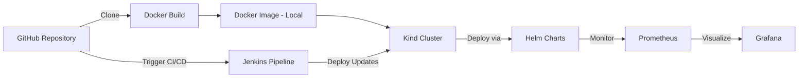
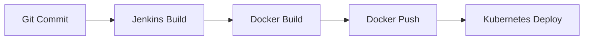

# 🚀 DevOps Project — Docker | Kubernetes | Helm | Jenkins | Prometheus | Grafana


---

## 📘 Project Overview

This project demonstrates a complete **DevOps workflow** — from source code to automated deployment and monitoring.

- Clone an existing project from GitHub  
- Containerize it using **Docker**  
- Create a local **Kubernetes cluster using Kind**  
- Deploy the application using **Kubernetes cluster**  
- Set up **Prometheus & Grafana** for monitoring using **using Helm Charts**  
- Implement a **Jenkins CI/CD pipeline** for automation  

---

## 🧩 Architecture Diagram




---

## 🐳 Docker — Build & Run (step-by-step)

1. Clone project

```bash

sudo apt update
sudo apt install -y docker.io
sudo systemctl enable --now docker
docker --version


```
2. Install Docker(Ubuntu)

```bash

sudo apt update
sudo apt install -y docker.io
sudo systemctl enable --now docker
docker --version

```
3. Build Image

```bash

docker build -t <dockerhub-user>/<image-name>:v1 .

```
4. Run Container locally

```bash

docker run -d --name myapp -p 8080:8080 <dockerhub-user>/<image-name>:v1

```

## ☸️ Kind — Local Kubernetes cluster

1. Install Kind

```bash
curl -Lo ./kind https://kind.sigs.k8s.io/dl/v0.22.0/kind-linux-amd64
chmod +x ./kind
sudo mv kind /usr/local/bin/kind
kind --version
```
2. Create a cluster

```bash

kind create cluster --name dev-cluster
kubectl cluster-info --context kind-dev-cluster
kubectl get nodes


```

3. Load local Docker image into Kind
```bash

kind load docker-image <dockerhub-user>/<image-name>:v1 --name dev-cluster

```


## 🎩 Helm + Prometheus + Grafana (monitoring)

1. Install Helm & add repos
```bash

curl https://raw.githubusercontent.com/helm/helm/main/scripts/get-helm-3 | bash
helm repo add prometheus-community https://prometheus-community.github.io/helm-charts
helm repo add grafana https://grafana.github.io/helm-charts
helm repo update

```
2. Install kube-prometheus-stack
```bash

kubectl create namespace monitoring
helm install monitoring prometheus-community/kube-prometheus-stack -n monitoring -f monitoring-values.yaml

```
4. Verify services
```bash
kubectl get svc -n monitoring
```

5. Access Prometheus & Grafana locally
```bash
kubectl port-forward svc/prometheus-operated 9090:9090 -n monitoring
# Open http://localhost:9090
kubectl port-forward svc/monitoring-grafana 3000:80 -n monitoring
# Open http://localhost:3000
```


## ⚙️ Jenkins — CI/CD pipeline


This project includes a fully automated CI/CD pipeline using Jenkins, which handles building, containerizing, and deploying the application.

🔧 What the Pipeline Does

Automatically triggers on every Git commit

Builds the application

Builds a Docker image

Deploys to Kubernetes (or server)


